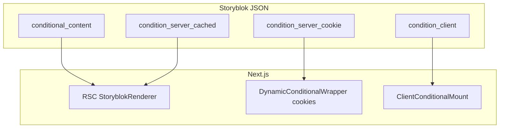

# Conditional content bloks (Storyblok + Next.js template)

## Goals

- **`conditional_content`**: wraps Storyblok UI in a `content` field; `conditions` is a nestable list of condition bloks; `operator` combines them (`all` = AND, `any` = OR).
- **Three scopes** map to where evaluation runs and how caching behaves:
  1. **Server / cache-safe** — safe inside statically cached pages (same HTML for all users sharing that cache entry).
  2. **Server / cookie (dynamic)** — must read cookies (or other private request data); page segment cannot rely on a single shared cached HTML without extra machinery.
  3. **Client** — needs browser APIs or post-hydration state; always defer visibility to the client.

---

## Storyblok schema (conceptual)

Use one parent blok and **one technical blok per condition type** (or a generic `condition` blok with a **single option field** `condition_type` + dynamic fields—nested components are usually clearer in Storyblok for editors).

### 1. `conditional_content`

| Field | Type | Notes |
|-------|------|--------|
| `content` | Blocks | Allowed: your layout/UI components (bloks). |
| `conditions` | Blocks | Allowed: only condition components (see below). |
| `operator` | Single option | e.g. `all` (AND), `any` (OR). |

Optional but useful for editors: `fallback_content` (Blocks) when conditions fail.

### 2. Shared fields on every condition blok

| Field | Type | Purpose |
|-------|------|--------|
| `scope` | Single option (read-only default per component, or one generic enum) | `server_cached` \| `server_cookie` \| `client` — documents intent; implementation can also infer scope from component technical name. |

If you use **separate Storyblok components per scope**, you can omit `scope` and rely on component type.

---

## Condition examples by scope

### Scope A — Server, OK for page-level cache (`server_cached`)

Evaluation uses only information that is **not user-private** and is **stable for a cache entry** (or you accept revalidation as the “moving” part).

| Example condition blok | What it checks | Caching note |
|------------------------|----------------|--------------|
| `condition_date_range` | `start`, `end` ISO strings; compare to **server** `new Date()` at render | Short `revalidate` or Edge if you need minute-level accuracy; otherwise acceptable for marketing windows. |
| `condition_url_match` | Path prefix or regex vs `headers()` / segment props | Works if URL is part of the route; same path ⇒ same cached page. |
| `condition_locale` | Matches active locale from `params.locale` or similar | Fine when routing defines locale. |
| `condition_storyblok_toggle` | Boolean from Storyblok only | Fully static at fetch time. |

**Avoid** in this scope: `cookies()`, `headers()` that vary per user without `Vary`, secrets.

### Scope B — Server, cookies / request-private (`server_cookie`)

| Example condition blok | What it checks | Why it bypasses naive page cache |
|------------------------|----------------|----------------------------------|
| `condition_cookie_equals` | Cookie name + expected value (or regex) | Different users ⇒ different output ⇒ use **dynamic rendering** for this subtree or whole layout. |
| `condition_ab_bucket` | Reads assignment cookie from A/B tool | Same. |
| `condition_auth_hint` | Session cookie presence | Same. |

**Implementation lever**: `cookies()` in a Server Component, `cache: 'no-store'` or `dynamic = 'force-dynamic'` on the route/layout wrapping these trees, or **`unstable_noStore()`** (Next.js 14+) around the fetch/eval path. Alternative: **middleware** sets a header or rewrites to path variants so ISR stays segmented.

### Scope C — Client (`client`)

| Example condition blok | What it checks |
|------------------------|----------------|
| `condition_viewport` | `matchMedia('(min-width: ...)')` |
| `condition_reduced_motion` | `matchMedia('(prefers-reduced-motion)')` |
| `condition_local_storage` | Key present/value (after consent) |
| `condition_geo_optional` | Only if you call browser geolocation (usually async + permission) |

These ship **placeholder or nothing** on first paint unless you use **CSS-only** tricks; typically wrap children in a small client component that evaluates and mounts children when `true`.

---

## Composition rule (important for templates)

- **`operator` applies within one `conditional_content` blok** to its `conditions` list.
- **Mixed scopes**: A single `conditional_content` may mix scopes only if you define behavior:
  - **Recommended**: Split into nested `conditional_content` bloks—outer server (cached), inner dynamic cookie wrapper, innermost client wrapper—or enforce **one scope per `conditional_content`** in the CMS validation docs.

Practical template rule: **evaluate in order: server_cached → server_cookie → client** (each stage gates the next).

---

## Next.js implementation sketch (template-level)



### 1. Storyblok component map

Register `conditional_content` and each `condition_*` blok with React components. Parent blok resolves `content` by reusing your existing `StoryblokComponent` renderer.

### 2. `ConditionalContent` (server component by default)

- Map `operator` to a reducer over booleans: `all` → every; `any` → some.
- **Partition** resolved condition bloks by scope (from component name or `scope` field):
  - If any **`server_cookie`** condition exists: wrap the inner pipeline in a **small Server Component** that calls `cookies()` and evaluates only those bloks, OR render a **`CookieConditional`** server component that receives serialized rule config as props (names/values from Storyblok only—no executable code from CMS).
  - If any **`client`** condition remains: render **`ClientConditional`** with children as React nodes (pass Storyblok blok JSON + component map, or pre-rendered server fallback).

### 3. Pseudocode shape (illustrative)

```tsx
// Server: cached-safe branch — no cookies()
const serverCachedOk = evaluateOperator(operator, cachedConditions.map(evalCached));

// If cookie conditions exist — separate component with dynamic server behavior
<CookieGate rules={cookieRules} operator={operator}>
  {/* Only reached if serverCachedOk */}
  <ClientGate rules={clientRules} operator={operator}>
    <StoryblokServerComponents bloks={content} />
  </ClientGate>
</CookieGate>
```

- **`CookieGate`**: `'use client'` is **not** required if it only uses `cookies()` in a Server Component—but then the parent route must be dynamic. Mark route segment `dynamic = 'force-dynamic'` **or** isolate to a **slot** loaded via `dynamic()` with `ssr: true` and no store cache.

- **`ClientGate`**: `'use client'`; `useEffect` / `matchMedia` / storage; **don’t render sensitive content until evaluated** if SEO matters; for promos, flash of hidden content is often acceptable with `visibility: hidden` until ready.

### 4. Caching strategy summary

| Scope | Next.js pattern |
|-------|-----------------|
| `server_cached` | Default ISR/SSG; conditions evaluated in RSC at render time for that cache entry. |
| `server_cookie` | `dynamic = 'force-dynamic'` for affected routes, `cookies()` in subtree, or middleware-based path splitting for cached variants. |
| `client` | Client component; optionally `ssr: false` for heavy widgets only if acceptable. |

### 5. Security / CMS hygiene

- Store **only declarative data** in Storyblok (cookie **names**, allowed values, date strings)—never arbitrary code.
- Validate all fields in code (allowlists for cookie names, enum for operators).

---

## Minimal file layout (when you scaffold the real app)

- `components/storyblok/ConditionalContent.tsx` — orchestration + operator.
- `components/storyblok/conditions/*` — one file per condition type / scope.
- `lib/conditions/evaluate.ts` — pure functions for date, URL, cookie match (unit-testable).
- Storyblok space: duplicate components from this template doc.

---

## Deliverables checklist for your template repo

1. Storyblok component definitions (screenshot or JSON export) for `conditional_content` + 2–3 example conditions per scope.
2. TypeScript types mirroring blok schemas (`ConditionalContentStory`, etc.).
3. `ConditionalContent` + `CookieGate` + `ClientGate` as above, wired to `storyblok-react` / `@storyblok/react` pattern you use.
4. Short README section: **when to use which scope** and **caching implications** for content editors and developers.

No existing files in this workspace need to change for this exercise; the above is drop-in guidance for the Next.js app you will create or already maintain.
